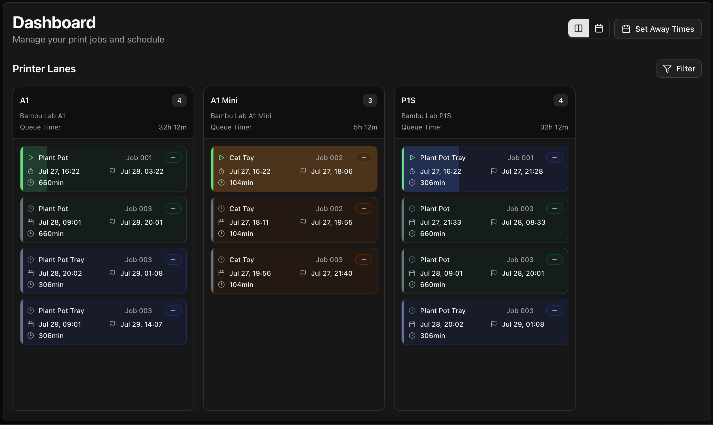
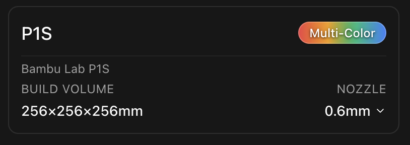
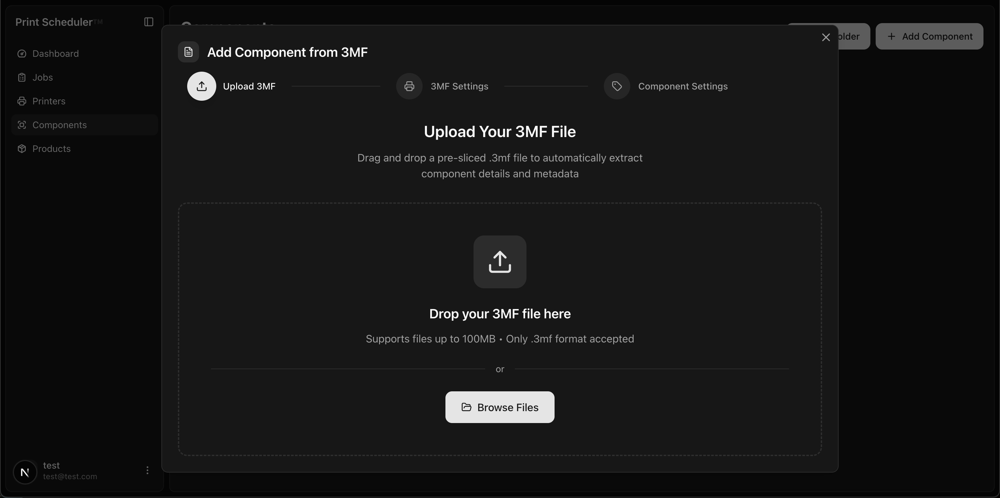
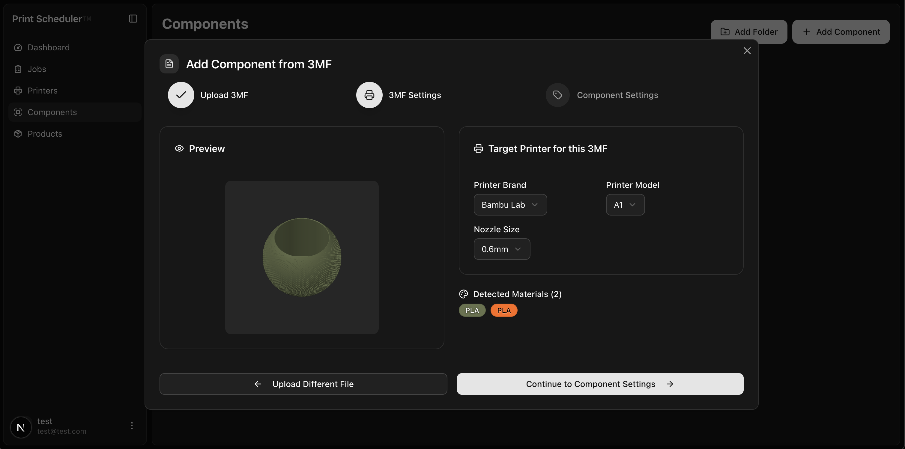
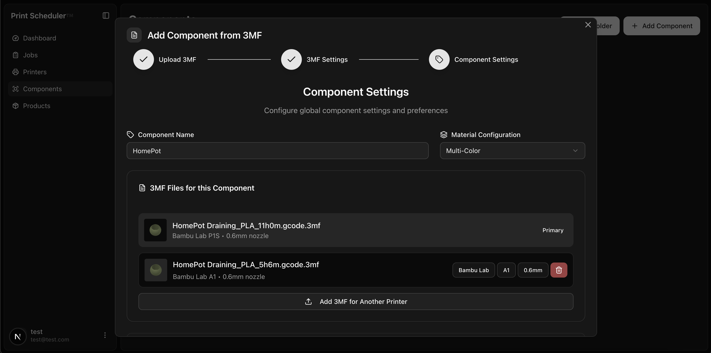
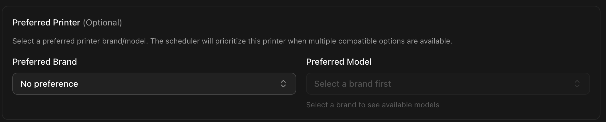
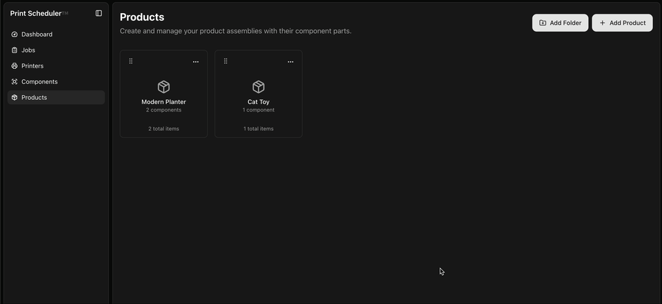
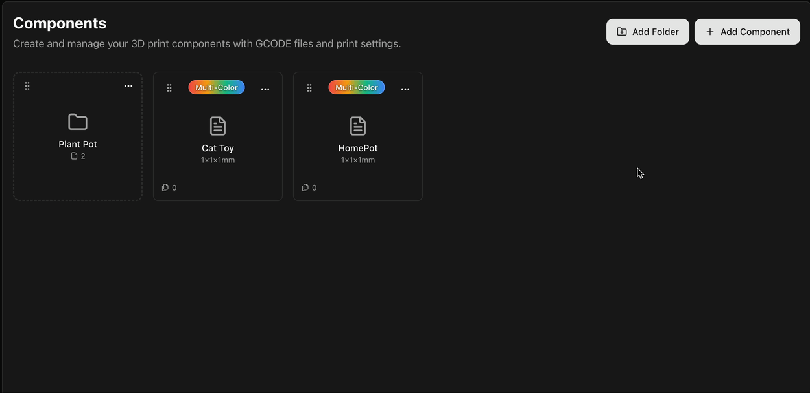
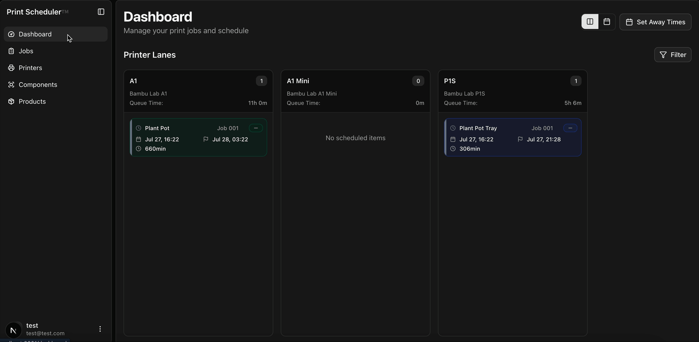

# Print Scheduler

After managing to take my 3D printing hobby a little too far and making a small side-gig on Etsy, I found it took an increasingly long amount of time trying to optimally plan the schedule for the printers. So I did what any engineer might think to do... Spend twice the amount of time creating a solution!

There are a couple of solutions online that cater to this, but nothing quite fit my requirements. 

The main goals for the app are:
1. Given a list of jobs containing multiple assemblies, dispatch them optimally to our printers.
2. Support a large number of constraints (e.g. print bed size, multi-color capability, nozzle size)
3. Support any number of 'away times'. For example, I need to sleep at some point, so adding a constraint that prints cannot *start* after 11pm, but they should be able to run and finish during that period.
4. Eventually support print dispatching via. Bambu Lab's Network Plugin.

## From Job to Schedule
To go from a job to a schedule requires some basic building blocks:

- Components
    - Represents a printable item
    - Stored in a [3MF file](https://en.wikipedia.org/wiki/3D_Manufacturing_Format), which can be sent to a printer
- Products
    - A collection of components
- Printers
    - Printers than can print components
- Jobs
    - A list of products to required

### Where things get tricky 
Each printer I own has their own area they excel in.

For example: My A1 Mini has a small build plate, a 0.4mm nozzle (for detail) and an AMS (can switch between different filaments)

The P1S has a larger print bed, a larger nozzle (0.6mm, faster for larger prints) and is much less efficient when changing filament colours. It also has a core-xy design meaning that the toolhead moves in the xy-direction, making for a much more stable print on larger items. All this means we'd like to assign larger prints with ideally none or few filament changes. 

Finally, the A1 has a larger bed, a 0.6mm nozzle, is much more efficient at multi colour prints, but is a [bed-slinger](https://all3dp.com/2/bed-slinger-3d-printing-simply-explained/). This means we'd prefer this printer to be assigned smaller multi color prints. 

## Putting it together
So... There's a few things to keep in mind when assigning a print. how do we do it?

### Printers

We can define printers limitations in the printers tab. This is where we can input the build plate size, material capabilities, and nozzle size. 

### Components
We create components from a 3MF file, this contains the instructions for the printer, as well as metadata about the print. 

After dragging the file in, we can see the extracted information.

The information here is important, printer make model and nozzle size indicates which printers this component can be dispatched to. 

We can then upload more 3MF files for other printers we want this component to be considered for when scheduling

This is where we can tell the scheduler if there's any printers we'd prefer the component to be scheduled to. e.g. our scenario earlier, the A1 is more efficient at multi color prints.

We can then create a product out of these components

With the added convenience of folders to organise your components and products. 

### The final step!
So now we've got the building blocks, we can create a job. This is a request to print a number of products. 
When the job is added, the scheduler analyses the constraints of the components in the products in the order. Looks at printer compatibility, and then assigns them based on these factors. 

## Next steps
Currently the application is just for personal use, and I'd like get to a point where the system is fully automated. 
e.g. receive jobs from Etsy/Shopify API, schedule them, dispatch to printers via local printer APIs.